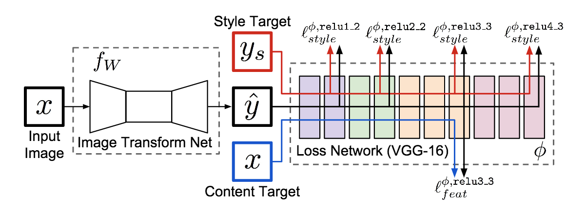

# Fast-neural-style-transfer

## Objective
I wanted to re-implement the [original](https://arxiv.org/abs/1508.06576) Neural Style Transfer paper from scratch but the problem with that was the per pixel loss made the results pleasaing to the eye but not very fast.

So I went forward with the perceptual loss from the [Fast Neural Style Transfer](https://cs.stanford.edu/people/jcjohns/eccv16/) as it solves
 - The NST in real time.
 - Super resolution for crisp results.
 
## The implementation idea for those who are new to paper implementations (like me!)

So first after reading the paper, I tried understanding the architecture of the system.

