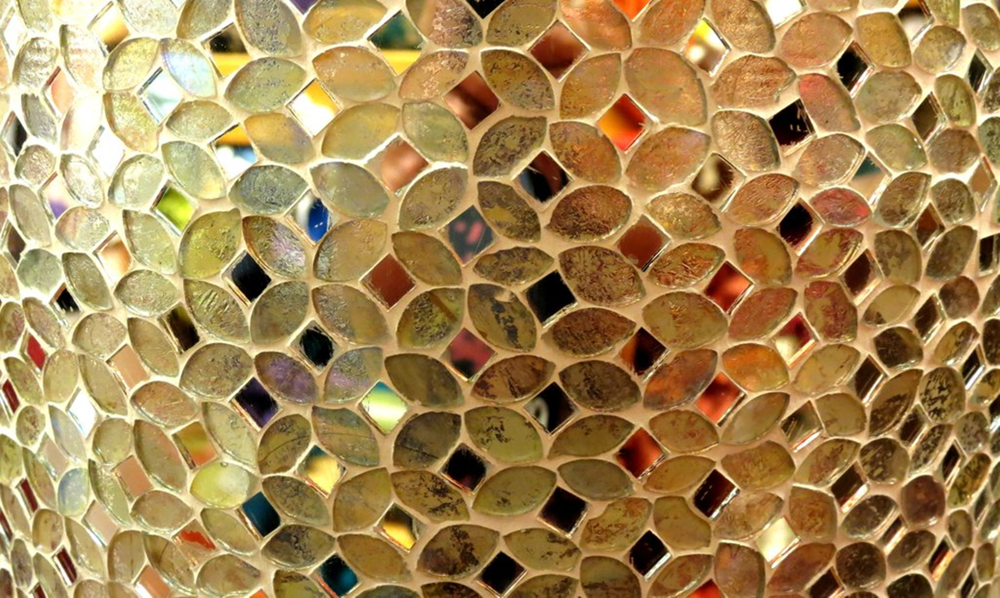
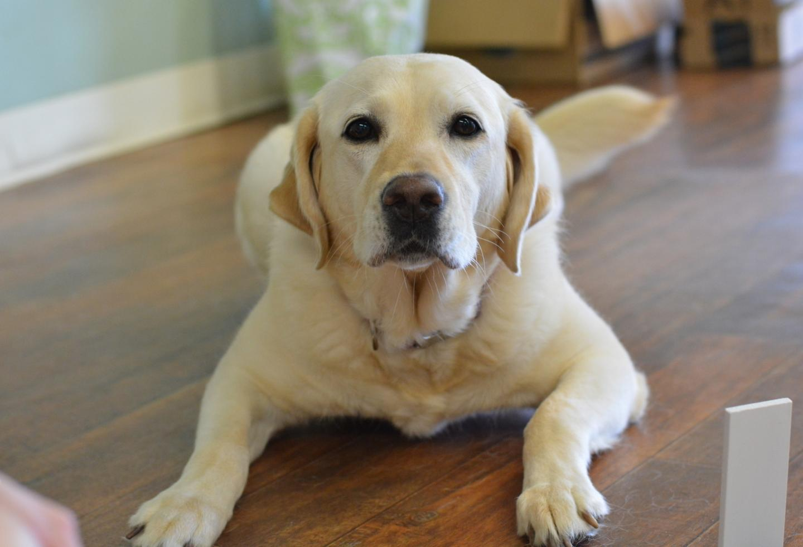
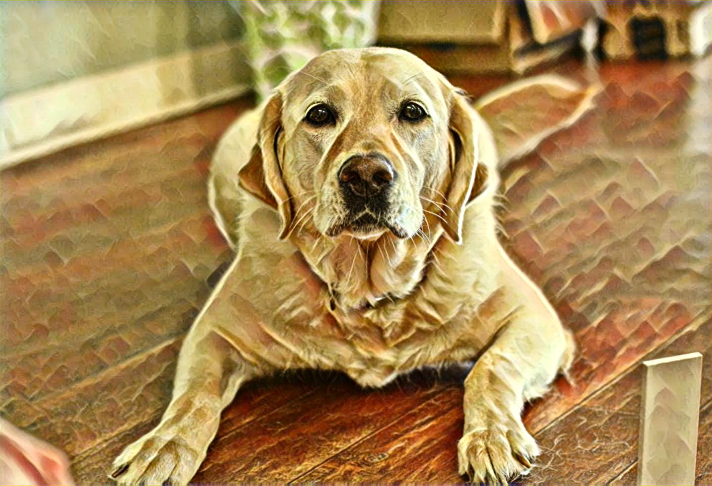

# Fast-neural-style-transfer


## Objective
I wanted to re-implement the [original](https://arxiv.org/abs/1508.06576) Neural Style Transfer paper from scratch but the problem with that was the per pixel loss made the results pleasaing to the eye but not very fast.

So I went forward with the perceptual loss from the [Fast Neural Style Transfer](https://cs.stanford.edu/people/jcjohns/eccv16/) as it solves
 - The NST in real time.
 - Super resolution for crisp results.
 
## The implementation idea for those who are new to paper implementations (like me!)

So first after reading the paper, I tried understanding the architecture of the system.


As we can see, the entire model comprises of two main part, the image transformation network and the vgg network.


The image transformation network used in the original paper is [given in here](https://cs.stanford.edu/people/jcjohns/papers/eccv16/JohnsonECCV16Supplementary.pdf)

So I started of making two seperate python files for the two different models.
 - loss_net.py
 - transformer_net.py
As the name suggests, on reading the paper, the meaning of each will be better umderstood as the loss_net.py is the vgg model and the transformer_net.py is the proposed model for the super resolution and feature extraction purpose.


the utils.py is just a simple python file which contains all the necessary helper functions like converting the images into nparrays and stylizing etc.

The Main file used to train the network is the nst_train.py

The nst_train.py contains a lot of cli arguments to run:-


To Train the model
```bash
python NST/nst_train.py train --dataset </path/to/train-dataset> --style-image </path/to/style/image> --vgg-model-dir </path/to/vgg/folder> --save-model-dir </path/to/save-model/folder> --epochs 2 --cuda 1
```

There are several command line arguments, the important ones are listed below
* `--dataset`: path to training dataset, the path should point to a folder containing another folder with all the training images. I used COCO 2014 Training images dataset [80K/13GB] [(download)](http://mscoco.org/dataset/#download).
* `--style-image`: path to style-image.
* `--vgg-model-dir`: path to folder where the vgg model will be downloaded.
* `--save-model-dir`: path to folder where trained model will be saved.
* `--cuda`: set it to 1 for running on GPU, 0 for CPU.

After the training is done, to stylize a new a image.
Stylize image
```
python NST/nst_train.py eval --content-image </path/to/content/image> --model </path/to/saved/model> --output-image </path/to/output/image> --cuda 0
```
* `--content-image`: path to content image you want to stylize.
* `--model`: saved model to be used for stylizing the image (eg: `mosaic.pth`)
* `--output-image`: path for saving the output image.
* `--content-scale`: factor for scaling down the content image if memory is an issue (eg: value of 2 will halve the height and width of content-image)
* `--cuda`: set it to 1 for running on GPU, 0 for CPU.

To understand about the training process, you need to go through the paper once.

Also a good link to understand the concept of FNST is [this](https://www.youtube.com/watch?v=VQEMptfWpLk&t=1s). Do check this out.


## Some examples

### Style image



I used only one style image due to the lack of copuutation resources.


### Centent images.




I am a dog lover so can't help it. Sorry!! 


### Final stylized image



Now that's a good boy!! 

#### The part which failed :( 

I tried the ffmpeg to split a mp4 file into frames and applying the trained model on it and stitching it back together but video looked completely washed off. :( Will be updating this in the future if I get a solution out of it.

